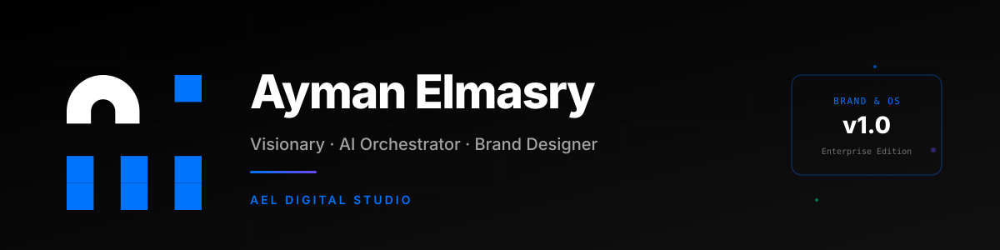

 

---

## 🎯 About

I define the vision behind digital products and orchestrate AI to bring that vision to life.

Founder of **AEL Digital Studio** — designing brand systems, AI-powered experiences, and digital platforms where strategy, design, and technology work as a unified system.

**Dubai · Egypt · Kuwait** — collaborating with clients worldwide to create distinctive brands, intelligent digital products, and long-term design systems.

---

## 🚀 Featured Projects

<table>
<tr>
<td width="50%" valign="top">

### 🎨 AEL Ωmega Platform
Sovereign color intelligence system with brand map analysis, 13-format export with SHA-256 integrity, and WCAG-compliant contrast verification.

</td>
<td width="50%" valign="top">

### 🧠 AEL Prompt Studio
Type-safe prompt engineering workbench with multi-provider AI orchestration and real-time cost tracking.

</td>
</tr>
<tr>
<td width="50%" valign="top">

### 🎓 AEL Learn GitHub
Interactive Git & GitHub course with 23 modules, 10 projects, quizzes, playground, and achievement system.

</td>
<td width="50%" valign="top">

### 📚 AEL Design System
Zero-dependency CSS component library with 12 components, 40+ variants, tokens, and copy-paste snippets.

</td>
</tr>
</table>

### 🔗 Explore More

---

## 🛠️ Tech Stack

---

## 📊 GitHub Stats

---

## 🎓 Certifications

- **Harvard CS50x** — Computer Science
- **IBM SkillsBuild** — Artificial Intelligence Fundamentals
- **AAST** — Mini Certificate in Digital Arts & Web Design
- **15+** verified professional certifications

---

## 📬 Get in Touch

---

**AEL Digital Studio** — *Engineering with purpose. Building with precision.*

© 2025 Ayman Elmasry · Licensed under [MIT](LICENSE)

